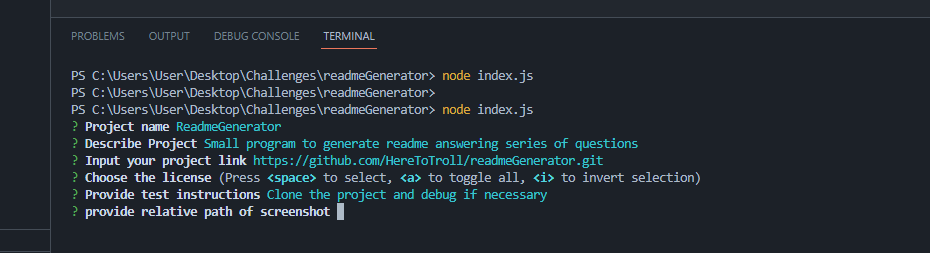

# README Generator  

Small app to generate simple readme. User will have to answer series of questions stored  
in the array. Simple to modify app and add more questions also include them in the generated  
redme. 


## Authors

- [Sergejs Hamjonoks](https://github.com/HereToTroll)


## Deployment

To deploy this project run

```bash
  git clone https://github.com/HereToTroll/readmeGenerator.git  
  npm install
```


## Screenshots




## License

[MIT](https://choosealicense.com/licenses/mit/)


## Support

For support or questions, email troll.legacy@gmail.com 

